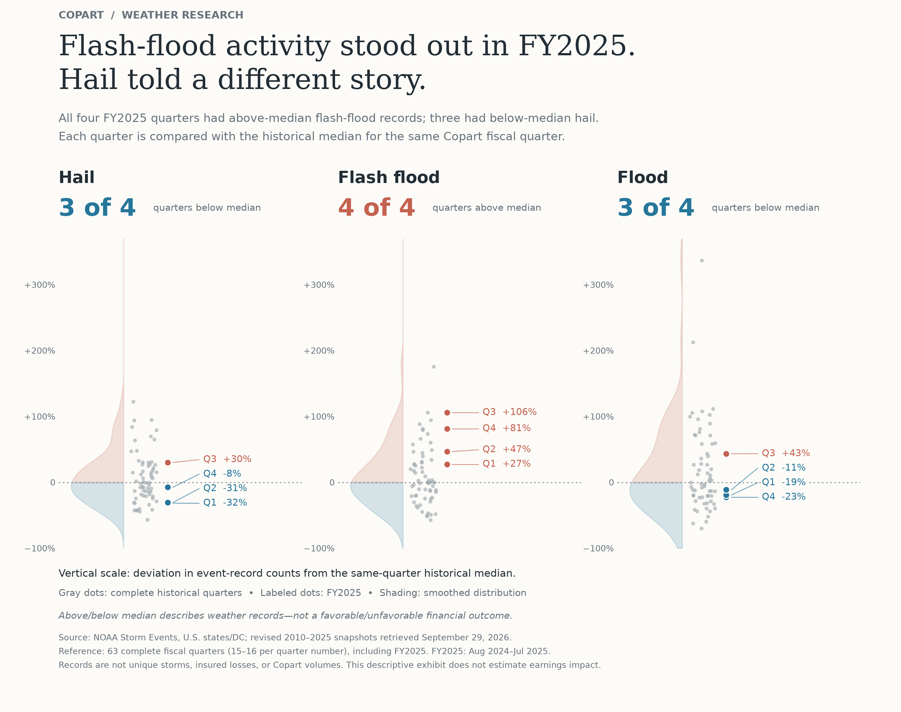
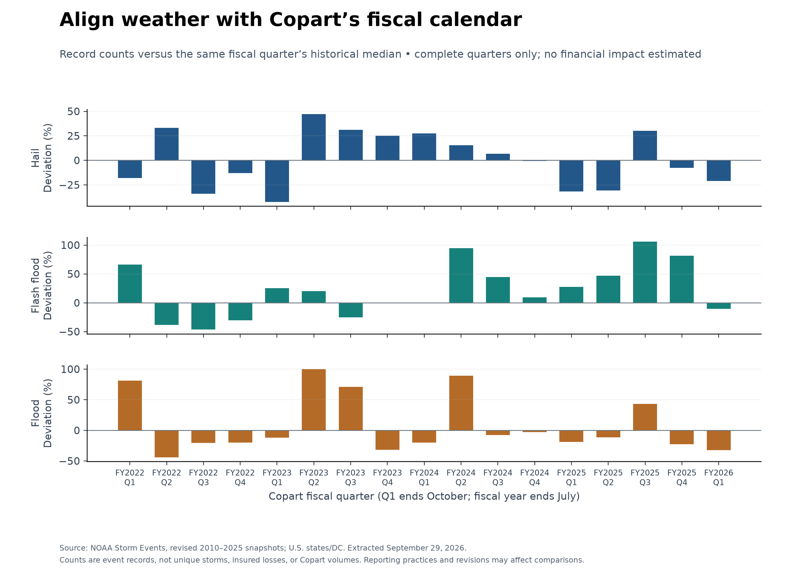
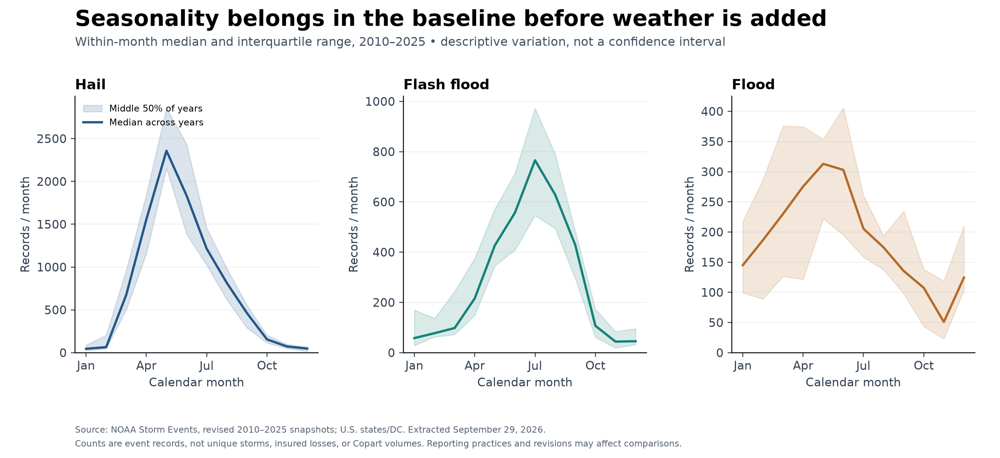
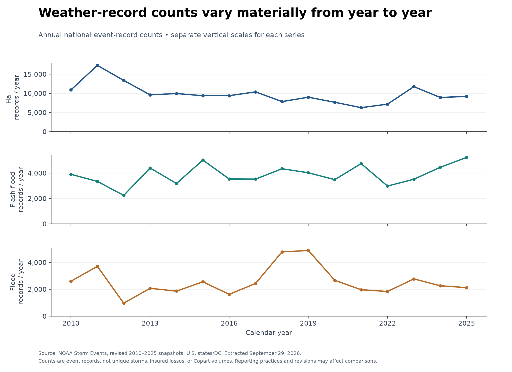

# Weather research figures

## Editorial distribution exhibit



The new editorial layout highlights the four quarters of FY2025, the latest complete fiscal year in this dataset. All four had above-median flash-flood records, while three had below-median hail and flood records. The reference is each quarter number's median among 63 complete quarters within the 2010–2025 calendar-year source, including the highlighted year. This selection is a complete fiscal year, not the latest four available quarters.

Gray dots show individual historical quarters; labeled colored dots show FY2025. Shading is a Gaussian kernel density estimate using Scott bandwidth, normalized separately to each panel's peak. Horizontal dot placement has no quantitative meaning. All panels share the same vertical percentage scale. Labels may be displaced for legibility; leader lines connect them to the true values. The extracted quarter values and source hash accompany the figure.

Regenerate with `python scripts/build_editorial_weather.py`. PNG is 240 dpi; SVG is vector. The style is inspired by the editorial distribution examples discussed at https://www.juiceanalytics.com/writing/20-best-examples-of-charts-and-graphs ; all plotted values come from the project's NOAA dataset. It is an AI-assisted research exhibit, not independently authored competition submission content.

These are descriptive research exhibits based on real NOAA data, not Copart financial forecasts. Use them to investigate and explain the weather component. The competition's submission-authorship restrictions still apply; these AI-assisted exhibits are research materials for the team to independently evaluate.

## Recommended main research exhibit: fiscal-quarter deviations



Each bar is `100 * (quarter count / median count for the same fiscal-quarter number - 1)`. The reference uses all complete quarters in the 2010–2025 dataset, including recent years; this is a retrospective descriptive comparison, not a historical forecasting feature. Partial boundary quarters are excluded. There are 15 or 16 reference observations per quarter number. Q1 ends October, Q2 January, Q3 April, and Q4 July.

Purpose: compare unusual weather periods on the same calendar as Copart's reporting. This does not establish incremental assignments, insured losses, or earnings. It also shows why hail, flash flood, and flood should not automatically be collapsed into one interchangeable measure. No hurricane-specific damage measure is included.

## Methods/supporting exhibit: seasonality



Lines show the median monthly count across 16 years; shaded bands show the 25th–75th percentiles. The bands describe variation across years, not uncertainty in the estimated median. Each panel uses its own vertical scale.

Purpose: motivate a seasonal baseline before attributing predictive value to weather. A model that merely learns spring/summer activity has not necessarily discovered useful incremental information.

## Background exhibit: annual history



Annual sums of event records, displayed separately by category. Each panel has a zero-based, independent vertical scale. Changes in reporting practices and revisions can affect comparisons; these figures do not establish a climate trend.

Purpose: provide context for variation over time and identify periods requiring closer source review.

## Files and regeneration

Each figure is provided as a 220-dpi PNG for easy insertion and an editable vector SVG for crisp resizing. The manifest records the input hash. The input is generated by the weather pipeline and is not committed to Git; exact raw-source URLs and hashes are in `../noaa-source-manifest.json`.

```powershell
.\.venv\Scripts\python.exe scripts/build_weather_figures.py
```

The script validates the complete 192-month input before creating the figures. Outputs are deliberately selected small report assets tracked in Git, unlike bulk datasets and experiment outputs.

## Financial exhibits to add once actuals are available

1. Held-out actual revenue versus baseline and weather-model predictions, with forecast origin and test periods visible.
2. Forecast-error comparison showing whether weather adds value over both simple baselines.
3. Revenue/earnings sensitivity through the friend's financial model, with explicitly sourced or judgmental assumptions.

Do not use synthetic test predictions, invent financial impacts, or substitute these descriptive weather charts for evidence of predictive performance. For a two-page memo, prioritize the strongest validated investment exhibit rather than trying to fit all three weather charts.
